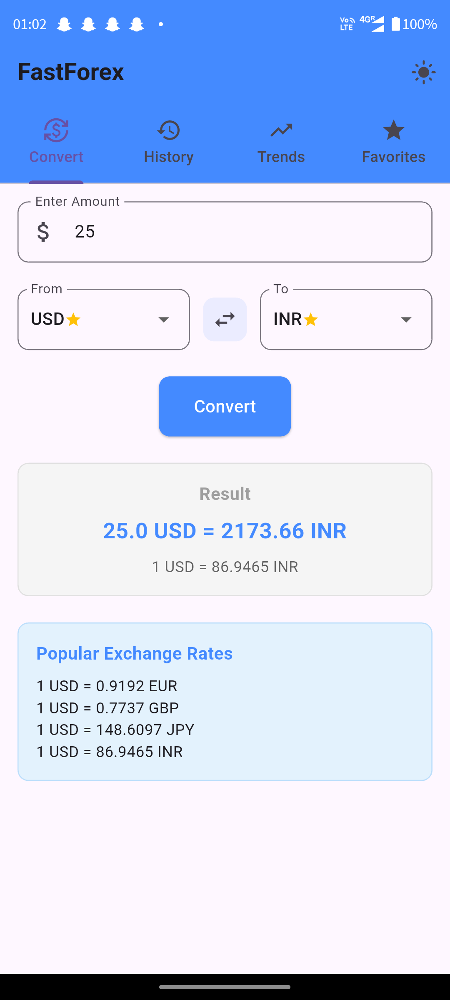
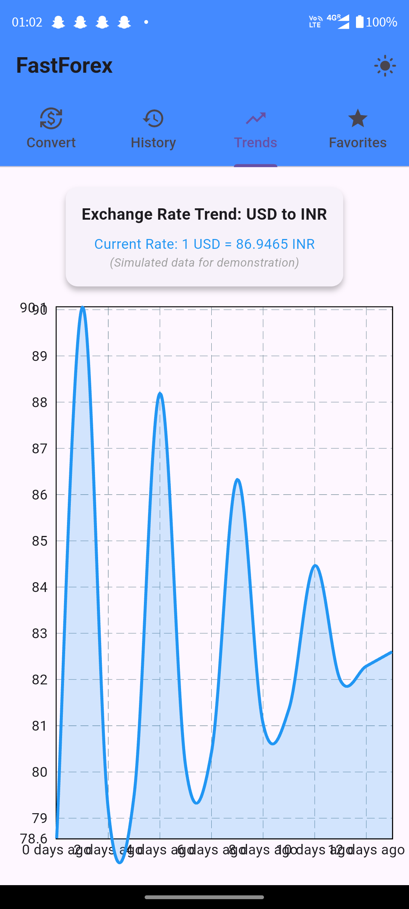
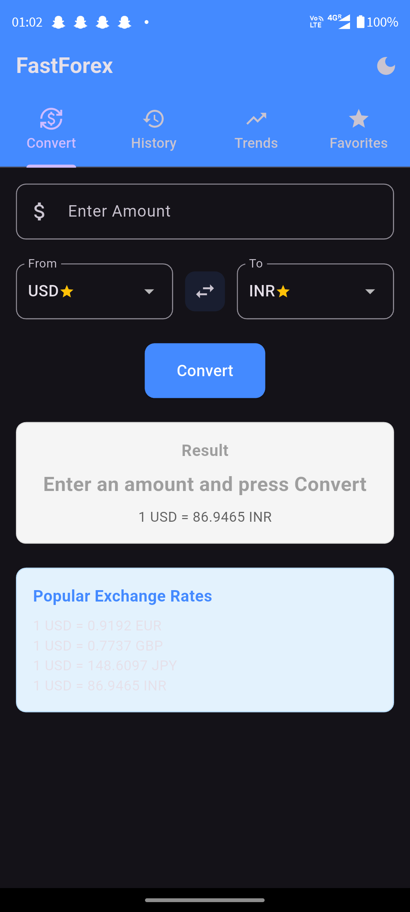

<div align="center">
  
# 💱 FastForex 💱


**Real-time currency conversion in your pocket**  
A sleek, modern Flutter app for instant currency exchange rates and conversions

[Features](#-features) • [Screenshots](#-screenshots) • [Installation](#-installation) • [Usage](#-how-to-use) • [Tech Stack](#%EF%B8%8F-tech-stack) • [Contributing](#-contributing) • [License](#-license)

</div>

<br/>

## ✨ Features

- **🔄 Real-time Currency Conversion** — Convert between currencies with up-to-date exchange rates
- **📊 Visual Trend Analysis** — Track exchange rate history with beautiful interactive charts
- **⭐ Favorites System** — Mark currencies for quick access and conversion
- **📝 Conversion History** — Keep track of your previous conversions
- **🌓 Light & Dark Themes** — Switch between visual modes for comfortable viewing
- **💯 Simple & Intuitive Interface** — Clean design focused on user experience
- **🚀 Lightning Fast Calculations** — Instant results with every input
- **📱 Responsive Design** — Works beautifully on any screen size

---

## 📱 Screenshots

<div align="center">
<table>
  <tr>
    <td></td>
    <td></td>
    <td></td>
  </tr>
  <tr>
    <td align="center"><b>Convert Screen</b></td>
    <td align="center"><b>Trends Screen</b></td>
    <td align="center"><b>Dark Mode</b></td>
  </tr>
</table>
</div>

---

## 📥 Installation

### Prerequisites
- Flutter SDK (2.12.0 or later)
- Dart SDK (2.17.0 or later)
- Android Studio / VS Code with Flutter plugins
- An API key from [OpenExchangeRates](https://openexchangerates.org/)

### Setup Instructions

1. **Clone this repository to your local machine:**

    ```bash
    git clone https://github.com/madboy482/FastForex.git
    ```
    
2. **Navigate to the project directory:**

    ```bash
    cd FastForex
    ```
    
3. **Install dependencies:**

   ```bash
   flutter pub get
   ```
   
4. **Configure the API Key:**
  - Obtain an API key from OpenExchangeRates by signing up at [OpenExchangeRates](https://openexchangerates.org/).
  - Replace `"your_api_key"` with your actual API key in **lib/utils/constants.dart**:

    ```dart
    class Constants {
    // API key for OpenExchangeRates
    static const String API_KEY = "your_api_key";
    ...
    ...
    }
    ```
    
5. **Run the app on your preferred platform:**
  - **Android:**

    ```bash
    flutter run
    ```
    
  - **Windows:**

    ```bash
    flutter run -d windows
    ```
    
  - **Web (Run on Chrome):**

    ```bash
    flutter run -d chrome
    ```

6. **Build for production:**

   ```bash
   # Android APK
   flutter build apk --release

   # Android App Bundle
   flutter build appbundle --release

   # Web application
   flutter build web --release

   # Windows application
   flutter build windows --release
   ```
   
---

## 📱 How to Use

### 💱 Currency Conversion  
- Enter the amount you want to convert.  
- Select source and target currencies.  
- Tap **"Convert"** to see the result.  
- Use the **swap button** to quickly reverse the conversion.  

### ⭐ Tracking Favorites  
- Star any currency to add it to your favorites.  
- Access your favorite currencies quickly from the **Favorites tab**.  

### 📈 Viewing Trends  
- Navigate to the **Trends tab** to visualize exchange rate history.  
- See how rates have changed over the last **14 days**.  

### 🕒 Managing History  
- View your past conversions in the **History tab**.  
- Delete individual history items by swiping.  

---

## 🛠️ Tech Stack  

- **Framework:** Flutter
- **API Integration:** OpenExchangeRates API
- **State Management:** Flutter’s built-in state management
- **Data Storage:** SharedPreferences for local storage
- **Charts & Visualization:** `fl_chart` package
- **Networking:** Dart `http` package

---

## 🧩 Project Structure
```bash
lib/
├── main.dart            # App entry point
├── models/              # Data models
│   └── currency.dart              # Currency data structure
│   └── conversion_history.dart    # Model for storing past conversions
├── screens/             # App screens
│   ├── home_screen.dart           # Main tabbed interface
│   ├── convert_screen.dart        # Currency conversion UI
│   ├── history_screen.dart        # Conversion history
│   ├── trends_screen.dart         # Exchange rate trends
│   └── favorites_screen.dart      # Favorite currencies
├── services/            # API services
│   └── currency_api_service.dart  # OpenExchangeRates API integration
├── utils/              
│   ├── constants.dart    # App constants and configurations
│   └── theme.dart        # Theme definitions and utilities
└── widgets/             # Reusable UI components
    └── exchange_rate_chart.dart      # Currency trend chart
    └── conversion_result_card.dart   # Displays converted currency amount
    └── currency_dropdown.dart        # Dropdown for selecting currencies
```

---

## 🚀 Future Enhancements
- [ ] **Currency Alerts** — Notifications when exchange rates reach target values
- [ ] **Currency Calculator** — Advanced calculator with multiple operations
- [ ] **Widgets** — Home screen widgets for quick conversion
- [ ] **Historical Data** — Extended historical data with custom date ranges
- [ ] **Multi-language Support** — Interface translations for global users
- [ ] **Currency News** — Latest updates and news affecting exchange rates

---

## 🤝 Contributing

Contributions are welcome! If you have ideas for improvements, feel free to fork the repo and submit a PR.

1. **Fork** the repository  
2. **Create a feature branch**: `git checkout -b feature-name`  
3. **Commit changes**: `git commit -m "Added new feature"`  
4. **Push to GitHub**: `git push origin feature-name`  
5. **Open a Pull Request** 🎉  

---

## 📜 License

This project is open-source and available under the **MIT License**.  
See the full license details [here](./LICENSE).

---

## ✨ Connect with Me  

- 💼 **GitHub:** [@madboy482](https://github.com/madboy482/)  
- 💼 **LinkedIn:** [Nalin](https://linkedin.com/in/nalin-vijayvargiya/)  
- 💼 **Portfolio:** [madboy482.me](https://madboy482-portfolio.vercel.app/)  

🌟 *If you like this project, don't forget to star the repo!* ⭐  
